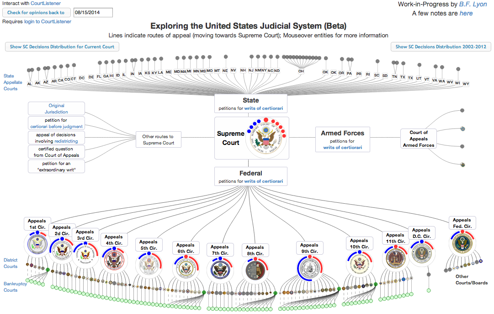

Exploring the US Judicial System - a Visualization
==========

This is a work-in-progress html/js visualization of the US Judicial System.

The plan is to eventually incorporate this visualization into the
[CourtListener](https://www.courtlistener.com) site as a part of the
[Free Law Project](http://freelawproject.org/).

## Viewing the Visualization

It is currently hosted [on google drive here](https://d57dd304fefca1aa423fea1b4dc59f23c06dd95e.googledrive.com/host/0B2GQktu-wcTiWm82NGt5MTZreHM/).

To view this standalone version locally:

* make sure you have [node](http://www.nodejs.org) installed
* clone the repository to your machine 
* run npm update
* run `grunt` from the commandline to build the consolidated minified javascript file 
* open the file index.html with a browser that supports svg (This includes Chrome, IE9+, Safari, Firefox, and Opera)

## Interacting with CourtListener

If you have logged into CourtListener via another browser window, then
this version can interact with the CourtListener api via jsonp to
gather info on the number of cases for each court back to a certain date.  While this
is throttled by CourtListener to only about 20 hits per court, it can still give
some idea of the activity across the courts (that CourtListener has scrapers for), and
provides a relatively easy way to go see the specific cases for the relevant courts.  
